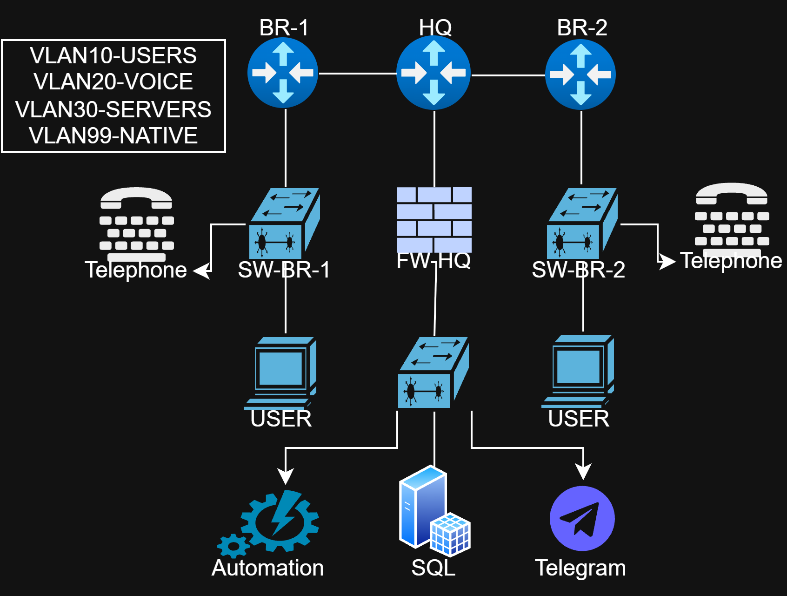

# Enterprise Network Automation Lab
## Network Topology



## Overview

This project demonstrates the design, configuration and automation of a multi-site Cisco enterprise network.

The lab combines networking, automation, monitoring and database logging technologies in a single environment.

## Technologies

- Cisco IOS
- OSPF
- VLANs
- Inter-VLAN Routing
- API
- SSH Management
- Python
- Netmiko
- Ansible
- MySQL
- Telegram Bot
- GNS3 / EVE-NG

---

## Network Topology

The lab contains:

- HQ Router
- Branch Router 1
- Branch Router 2
- Core Switch
- Branch Switches
- Multiple VLANs
- OSPF Routing

---

## Features

### Cisco Configuration

- Secure SSH Access
- Local Authentication
- RSA Keys
- OSPF Routing
- VLAN Configuration
- Trunk Links
- Inter-VLAN Routing

### Network Automation

Using Ansible:

- Configure multiple Cisco devices
- Push MOTD Banner
- Inventory Management

Using Python:

- Device Monitoring
- Automatic Failure Detection
- Telegram Alerts
- MySQL Logging

---

## Project Structure

```
Automation/
    Hosts
    Playbooks

Configure/
    Router Configurations
    Switch Configurations

Code/
    Ansible Examples

Python/
    Monitoring Scripts

SQL/
    Database Integration
```

---

## Monitoring

Python continuously checks network devices.

If a device becomes unreachable:

- Telegram notification is sent
- Error is logged into MySQL

---

## Skills Demonstrated

- Enterprise Networking
- Cisco IOS
- OSPF
- VLAN Design
- Network Automation
- Python Programming
- Ansible
- SQL Integration
- Monitoring Systems

---

## Author

Shufel
